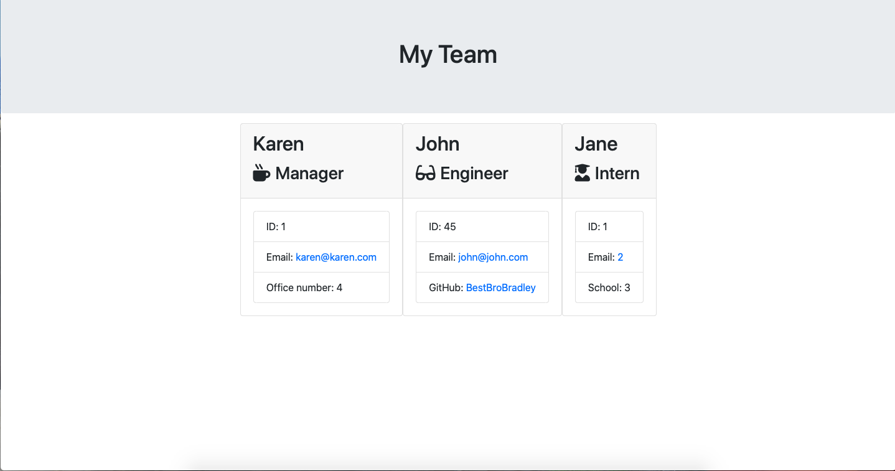

# unit-ten-homework

Team Profie Builder

In this program, a user can dynamically generate an HTML page with information about their current team members, including a manager, any number of engineers, and any number of interns.

The user can also include useful information regarding each of the employees, such as:

-Email
-ID
-GitHub username (Engineers only)
-Current school (Interns only)

This is a useful tool for anyone who wants to make a quick profile of a team, and could be easily scaled to include different types of teams.

Link to repo:
[https://github.com/BestBroBradley/unit-ten-homework](https://github.com/BestBroBradley/unit-ten-homework)

# Functionality:

In the command line, the user will input their manager's information, then select which additional employee they would like to include.  There is also an option for the user to terminate the function when they are done.  This information will then populate into the provided HTML functionality.

Generated HTML page:
